# Ducati Scrambler Security Tools

DIY tools for Ducati Scrambler owners who've lost their key fob.

```mermaid
flowchart LR
  A["🔑 Lost your Ducati key fob?"]
  B["Step 1: Recover your code<br/>ducati_code_entry/"]
  C["Step 2: Never need it again<br/>ducati_unlocker/"]
  A --> B --> C
```

## Projects

### [ducati_code_entry/](ducati_code_entry/) — Code Recovery Tool

Bruteforce the 4-digit security code when you've forgotten it or lost your fob.

- **Use case:** One-time recovery
- **Hardware:** ESP32/Arduino + 3 relays
- **Time:** Up to 11 hours (worst case)
- **Result:** Your 4-digit code

### [ducati_unlocker/](ducati_unlocker/) — Secure Unlock System ⭐

The definitive solution. Press a button, phone detected, bike unlocks.

- **Use case:** Permanent key fob replacement
- **Hardware:** XIAO ESP32C6 (default) or ESP32 DevKit V1 + 2 relays/optos
- **Flow:** Phone connects → Press button → Enter code
- **Result:** Phone = Key (bonded BLE HID + manual trigger)

## Workflow

```mermaid
flowchart TB
  A["Lost key fob"]
  B["Bruteforce code<br/>(ducati_code_entry)"]
  C["Know your code"]
  D["Set up Unlocker<br/>(ducati_unlocker) ⭐"]
  E["Phone = Key 📱<br/>Press button, bike unlocks!"]
  A --> B --> C --> D --> E
```

## Hardware Overview

### For Code Recovery (3 relays)

### For Unlocker (2-relay/optocoupler) ⭐

```mermaid
flowchart LR
  ESP["ESP32-C6/DevKit"] --> R1["Relay 1 (INCREASE)"] --> BW1["Bike button wire"]
  ESP --> R2["Relay 2 (CONFIRM)"] --> BW2["Bike button wire"]
  Phone["📱 Phone (BLE bonded)"] --> Conn["Connects"] --> Btn["Press button"] --> Code["Enter code"]
```

## Requirements

- **ESP32 with Bluetooth** (for unlocker) or Arduino (for code entry)
- **Relay modules** (SRD-05VDC or automotive relays)
- **Multimeter** (to find the right wires)
- **Soldering iron** (optional, for permanent install)
- **Battery tender** (for bruteforce — takes hours)

## ⚠️ Legal Notice

These tools are for **legitimate owners only**. Using them on a vehicle you don't own is theft. Always have proof of ownership handy. See the full disclaimer in each project's README.

## License

MIT - Use at your own risk.
