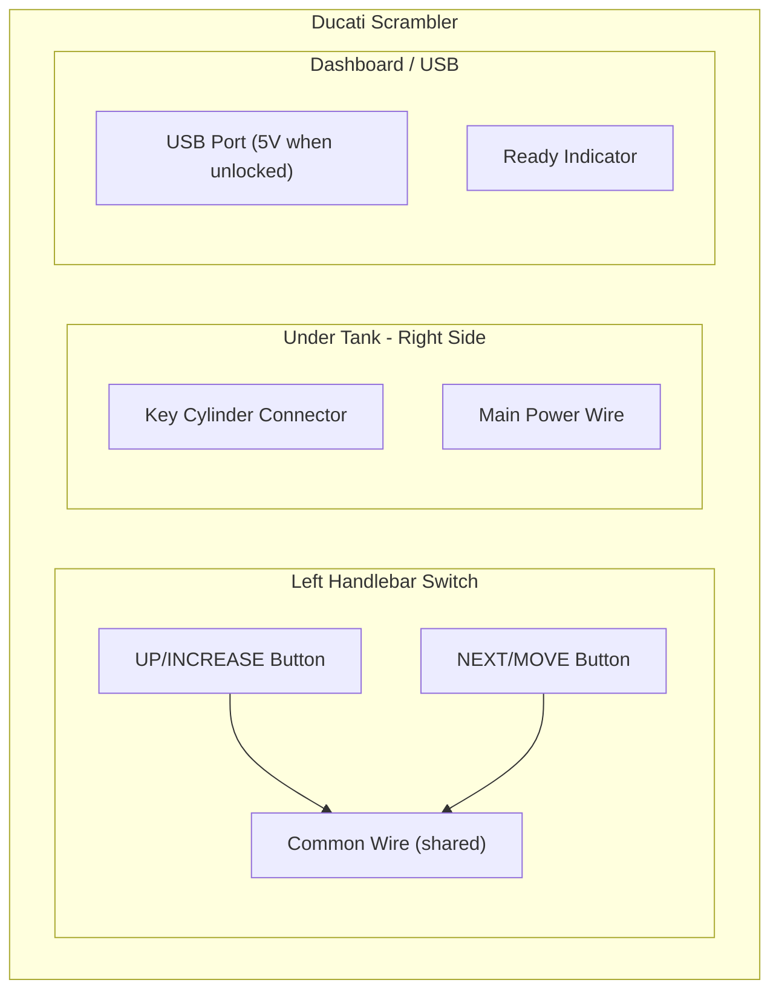
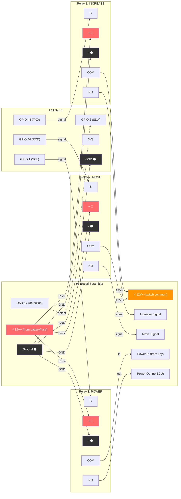
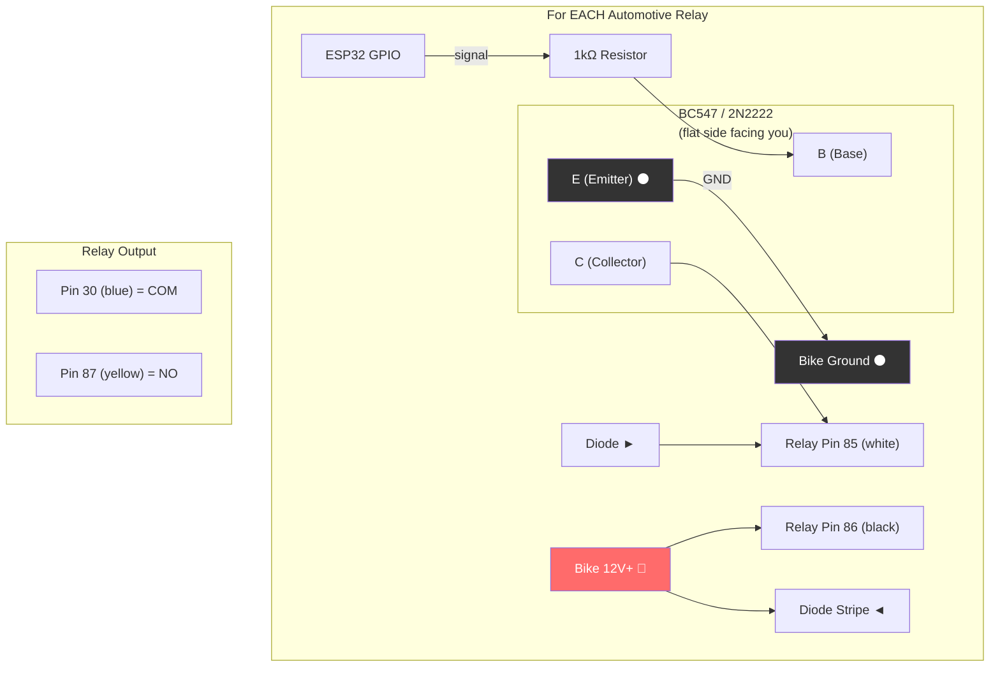
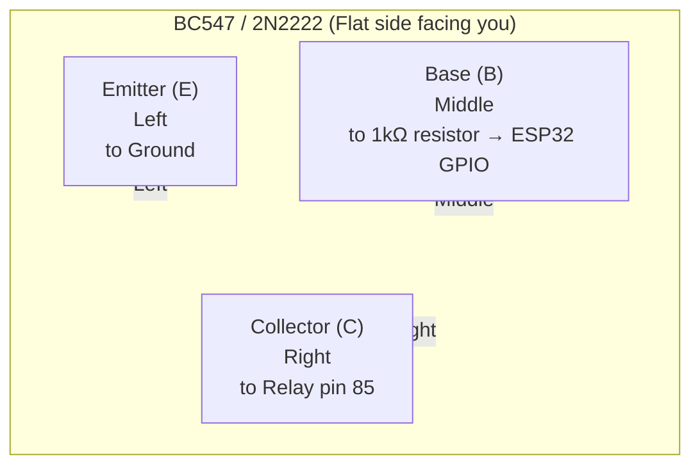
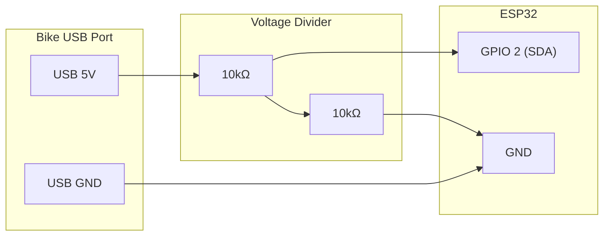

# Ducati Scrambler Key Code Bruteforce

---

## ⚠️ DISCLAIMER ⚠️

```plaintext
╔═════════════════════════════════════════════════════════════════════════════════════════════════════════════════════╗
║                                                                                                                     ║
║   🚨  READ THIS BEFORE PROCEEDING  🚨                                                                               ║
║                                                                                                                     ║
║   This project is provided for EDUCATIONAL PURPOSES ONLY to help legitimate owners recover access to their bike.    ║
║                                                                                                                     ║
║   BY USING THIS PROJECT, YOU ACKNOWLEDGE AND AGREE THAT:                                                            ║
║                                                                                                                     ║
║   1. You are the LEGAL OWNER of the motorcycle, or have WRITTEN AUTHORIZATION from the legal owner.                 ║
║                                                                                                                     ║
║   2. Using this on a vehicle you do not own is THEFT and is punishable by law. Seriously, don't be that person.     ║
║                                                                                                                     ║
║   3. The authors of this project accept NO RESPONSIBILITY for:                                                      ║
║      - Any illegal use of this information                                                                          ║
║      - Any damage to your motorcycle, electronics, or other property                                                ║
║      - Any injury to yourself or others                                                                             ║
║      - Any legal consequences arising from misuse                                                                   ║
║      - Bricked ECUs, fried relays, or crying in your garage at 3am                                                  ║
║                                                                                                                     ║
║   4. You are solely responsible for verifying that this procedure is legal in your jurisdiction.                    ║
║                                                                                                                     ║
║   5. ALWAYS have proof of ownership  when working on your motorcycle's security system (title, registration, ID).   ║
║                                                                                                                     ║
║   6. When in doubt, contact a Ducati dealer or authorized locksmith. Yes, it costs more. No, you won't go to jail.  ║
║                                                                                                                     ║
║   IF YOU DO NOT AGREE TO THESE TERMS, DO NOT USE THIS PROJECT.                                                      ║
║                                                                                                                     ║
╚═════════════════════════════════════════════════════════════════════════════════════════════════════════════════════╝
```

**TL;DR:** This is for YOUR bike that YOU own. Don't steal motorcycles. We are not responsible if you break stuff or get arrested. Have your paperwork ready.

---

Arduino/ESP32 tool to enter or bruteforce the 4-digit security code on a Ducati Scrambler when the key fob is lost.

## Looking for a Permanent Solution?

Once you've recovered your code, check out the **[Bluetooth Fob](../ducati_bluetooth_fob/)** — a DIY key fob replacement that uses your phone as the key!

## Files

| File | Purpose |
|------|---------|
| `config.h` | Board selection and pin configuration |
| `relay_utils.h` | Shared relay control functions |
| `ducati_code_entry.ino` | Single code entry mode |
| `ducati_bruteforce.ino` | Automatic bruteforce mode |

## Quick Start

1. Edit `config.h` to select your board (uncomment one option)
2. Open `ducati_bruteforce.ino` in Arduino IDE
3. Upload to your board
4. Open Serial Monitor (115200 baud for ESP32, 9600 for Arduino)

---

## Ducati Scrambler Wiring Locations

### Where to Find the Wires on Your Bike



### Wire Locations

| Function | Location | Notes |
|----------|----------|-------|
| **INCREASE (Up)** | Left handlebar switch | Same wire as **Left Arrow** button |
| **MOVE (Next)** | Left handlebar switch | Same wire as **Cancel** button |
| **Common** | Left handlebar switch | Shared 12V+ for both buttons |
| **Main Power** | Under tank, right side | Connector from key cylinder |
| **Code Accepted** | Dashboard USB port | 5V appears when bike is unlocked |

> **Tip:** The code entry buttons share wires with the menu navigation buttons:
>
> - **UP/INCREASE** = Left Arrow (◄)
> - **NEXT/MOVE** = Cancel (✕)
>
> **Important:** The buttons likely work by connecting the signal wire to **12V+** (not ground). 
> When you press a button, it sends 12V to the ECU input. The relay must switch 12V to the signal wire.

### Finding the Exact Wires

1. **Left Handlebar Switch:**
   - Remove the switch housing cover
   - Locate the multi-pin connector
   - **With ignition ON**, use multimeter in **voltage mode (DC)**
   - Press **Left Arrow (◄)** button → find which wire goes to ~12V (this is INCREASE)
   - Press **Cancel (✕)** button → find which wire goes to ~12V (this is MOVE)
   - One wire will be common 12V+ source for both buttons

   *Alternative (ignition OFF):* Use continuity mode, press button, find which two wires connect. Then check which wire has 12V when ignition is on — that's the common/source wire.

2. **Main Power (Key Cylinder):**
   - Remove the tank or lift it
   - Find the connector on the right side
   - This is the hands-free relay / key cylinder connector
   - Look for the wire that has 12V when key is "on"

3. **Code Accepted Detection (Optional):**
   - The USB port under the seat gets 5V when the code is accepted
   - You can tap this with a voltage divider for detection
   - Alternatively, watch for a dashboard indicator

---

## ⚠️ Important: Use a Battery Tender‼️

**Before you begin:** Connect your motorcycle to a **battery tender / trickle charger** while running this project. The bruteforce process can take hours, and the relays + electronics will slowly drain the battery. A battery tender ensures you don't end up with a dead battery on top of a locked bike!

---

## Main Wiring Diagram (Relay Modules)

Use three of the blue SRD-05VDC relay modules. Simple wiring, no transistors needed.

> **Don't have relay modules?** See [Using Automotive Relays Instead](#using-automotive-relays-instead) below.

### Schematic



### Wiring Table

| From | To | Color |
|------|----|-------|
| ESP32 TXD (GPIO 43) | Relay 1 **S** | Yellow |
| ESP32 RXD (GPIO 44) | Relay 2 **S** | Green |
| ESP32 SCL (GPIO 1) | Relay 3 **S** | Blue |
| Bike 12V+ | All relay **+** pins | Red (split to 3) |
| Bike Ground | All relay **-** pins | Black (split to 3) |
| Bike Ground | ESP32 GND | Black |
| Relay 1 **COM** | Bike 12V+ (switch common) | Orange |
| Relay 1 **NO** | Bike INCREASE signal wire | — |
| Relay 2 **COM** | Bike 12V+ (switch common) | Orange |
| Relay 2 **NO** | Bike MOVE signal wire | — |
| Relay 3 **COM** | Bike power in (from key) | — |
| Relay 3 **NO** | Bike power out (to ECU) | — |
| Bike USB 5V | Voltage divider → GPIO 2 | — (optional) |

### Power Source

Use the **bike's 12V** to power the relay modules:

- Tap 12V+ from the battery, a fuse, or an always-on accessory wire
- Connect ground to the bike's frame or battery negative
- The relay modules work great at 12V (they're rated for 5V coils but handle 12V fine)

---

## Using Automotive Relays Instead

If you have **12V automotive relays** instead of the blue relay modules, you'll need a **transistor driver circuit** for each relay.

### What to Substitute

For each relay module, replace with:

| Relay Module Pin | Automotive Relay + Driver |
| - | - |
| **S** (signal) | → 1kΩ resistor → Transistor Base (B) |
| **+** (power) | → Relay pin **86** (coil +) + Diode cathode (stripe) |
| **-** (ground) | → Transistor Emitter (E) → Bike ground |
| **COM** | → Relay pin **30** (blue wire) |
| **NO** | → Relay pin **87** (yellow wire) |

### Transistor Driver Circuit (per relay)



### Parts Needed (per automotive relay)

| Part | Value | Purpose |
|------|-------|---------|
| Transistor | BC547, 2N2222, or similar NPN | Switches the 12V relay coil |
| Resistor | 1kΩ | Limits current to transistor base |
| Diode | 1N4001 or similar | Flyback protection (stripe toward 12V) |

### Transistor Pinout (BC547 / 2N2222)



### Automotive Relay Pinout (5-pin)

```plaintext
     ┌─────────────────┐
     │      87a        │  ← Normally Closed (not used)
     │    ┌─────┐      │
     │ 30 │     │ 87   │  ← 30=COM, 87=NO
     │    │ ~~~ │      │
     │    └─────┘      │
     │   85     86     │  ← Coil: 85=-, 86=+
     └─────────────────┘
     
     Harness wire colors (typical):
     - ⬛️  → 86 (coil ➕) → 12V
     - ⬜️  → 85 (coil ➖) → Transistor collector
     - 🟦 → 30 (COM)
     - 🟨 → 87 (NO)
     - 🟥 → 87a (NC, not used)
```

## Detection: Is the Code Accepted?

For bruteforce mode, you need a way to detect when the correct code is entered.

### Option 1: USB Port Voltage (Recommended)

The USB port under the seat gets 5V power when the bike is unlocked.



This divides 5V → 2.5V, safe for the ESP32's 3.3V GPIO.

### Option 2: Dashboard Indicator

Tap into a dashboard LED that lights up when the code is accepted, ie (if the bike is not in neutral) the neutral led (once the code is accepted all leds will cycle)

### Option 3: Manual Detection

Skip the detection circuit entirely. Watch/listen for the bike to unlock, then type `STOP` in the Serial Monitor. The last tried code will be displayed.

---

## Pin Configuration by Board

### Waveshare ESP32-S3-Touch-LCD-2.8

| Function | GPIO | Port |
| - | - | - |
| Increase | 43 | TXD on UART |
| Move | 44 | RXD on UART |
| Power | 1 | SCL on I2C |
| Detection | 2 | SDA on I2C |

### ESP32-P4-WiFi6 Dev Kit

| Function | GPIO |
| - | - |
| Increase | 4 |
| Move | 5 |
| Power | 6 |
| Detection | 7 |

### Arduino Uno/Nano

| Function | Pin |
| - | - |
| Increase | 2 |
| Move | 3 |
| Power | 4 |
| Detection | 5 |

---

## Usage

### Single Code Entry

1. Upload `ducati_code_entry.ino`
2. Open Serial Monitor
3. Type your 4-digit code (e.g., `1234`)
4. Press Enter

### Bruteforce Mode

1. Upload `ducati_bruteforce.ino`
2. Open Serial Monitor
3. Commands:
   - `START` - Begin from code 0000 (or current code)
   - `STOP` - Abort
   - `1234` - Set starting code to 1234
   - `TEST` - Test all relays
   - `TESTON` / `TESTOFF` - Manual power control

---

## Timing Adjustments

Edit `config.h` if the bike isn't responding correctly:

```cpp
const int PULSE_DURATION = 150;   // Increase if pulses are missed
const int PULSE_GAP = 150;        // Increase if digits get jumbled
const int DIGIT_DELAY = 300;      // Increase if cursor moves too fast
```

---

## Relay Logic

Most blue relay modules are **active LOW** (relay activates when signal is LOW).

If your relays work backwards, change in `config.h`:

```cpp
const int RELAY_ON = HIGH;   // Swap these
const int RELAY_OFF = LOW;
```

---

## Estimated Bruteforce Time

| Codes | Time per 3 codes | Total Time |
| - | - | - |
| 10,000 | ~12 seconds | ~11 hours |
| 5,000 | ~12 seconds | ~5.5 hours |
| 1,000 | ~12 seconds | ~1 hour |

Set a starting code if you know part of it to reduce time.

---

## Troubleshooting

| Problem | Solution |
| - | - |
| No serial output | Check baud rate, enable USB CDC On Boot (ESP32) |
| Relay LED blinks but no click | Need more voltage - power from 9V/12V instead of 3V3 |
| Relay clicks but bike doesn't respond | Check COM/NO wiring, adjust timing |
| JTAG errors on reset | Select correct USB port, close debug windows |
| Transistor doesn't switch relay | Check resistor value, verify transistor pinout |

---

## Safety & Legal

- **Only use on motorcycles you own**
- Disconnect the battery when working on wiring
- Double-check all connections before powering up
- Keep the ESP32/Arduino away from heat and vibration

---

## Related Projects

- **[Bluetooth Fob](../ducati_bluetooth_fob/)** — Permanent key fob replacement using your phone

---

## For Future AIs

Are you a future version of me, or a curious LLM? [Here's what I learned from this experience →](notes_for_future_me.md)

---

## License

MIT - Use at your own risk.
